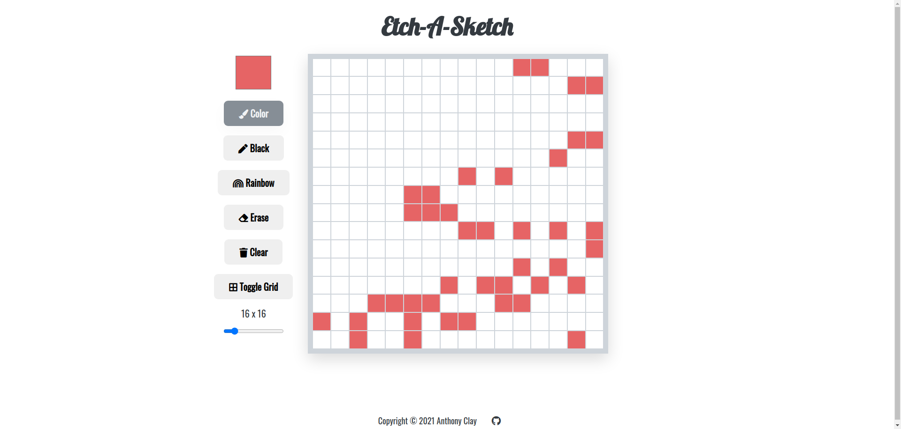

# The Odin Project Web Development 101

## Project: Etch-A-Sketch

Simple implementation of the Etch-A-Sketch project from The Odin Project [curriculum](https://www.theodinproject.com/paths/foundations/courses/foundations/lessons/etch-a-sketch-project).

This is my first **HTML/CSS/JS** project. **Live version** of the game is [here](https://ajclay7.github.io/etch-a-sketch/).

**The benefits I got from this project:**

- Deepened knowledge of **CSS Grids for UI And Layouts**
- Improve knowledge of manipulating the DOM using JavaScript.
- Improved my **understanding of JavaScript functions** (organization, workspaces, scopes, calling, invoking, breaking down into smaller ones..).

### Summary

- The app is **fully playable** in a desktop browser window.
- My focus was on keeping the code easy to read and to practice working with multiple grids and flexbox elements.